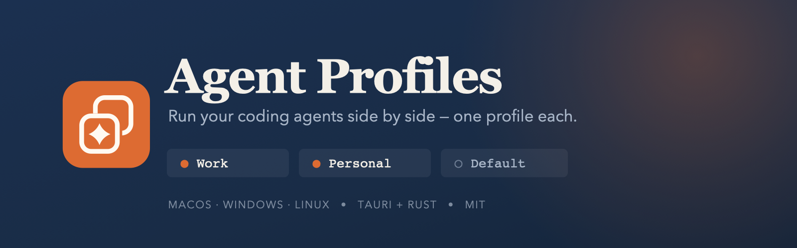

<p align="center">
  
</p>

<p align="center">
  <a href="https://github.com/husniadil/agent-profiles/actions/workflows/ci.yml"></a>
  <a href="LICENSE"></a>
  
</p>

# Agent Profiles

> **Unofficial.** This is a third-party tool with no affiliation to, endorsement by, or support from Anthropic or OpenAI. "Claude" and "Claude Desktop" are trademarks of Anthropic; "ChatGPT" and "Codex" are trademarks of OpenAI. This project only launches the applications you already installed, pointed at a different profile directory.

Agent Profiles is a menu bar and system tray app for running several accounts of a coding-agent desktop app in parallel, one profile each. Every profile gets its own permanently separate directory, so using one account never requires signing out of another — and profiles of different apps can run at the same time.

## Supported apps

| App | Profile is selected by | Shared file | Platforms | Notes |
| --- | --- | --- | --- | --- |
| **Claude** (Claude Desktop) | `--user-data-dir` | `claude_desktop_config.json` | macOS, Windows, Linux | |
| **ChatGPT** (bundle id `com.openai.codex`) | `--user-data-dir` **and** `CODEX_HOME` | `config.toml` | macOS, Windows, Linux | the `codex` CLI reads the same `CODEX_HOME` |
| **Cursor** | `--user-data-dir` | — | macOS | |
| **Devin** | `--user-data-dir` | — | macOS | ships as Devin, identifies as `com.exafunction.windsurf` |
| **T3 Code** | `--user-data-dir` | — | macOS | |
| **VS Code** | `--user-data-dir` | — | macOS | |

Every one of these was confirmed against a real installation by the probe described below, never declared from inspection alone.

**Platforms** lists where an app has actually been checked. Where it has not, the app is simply absent — no tray section, no directory, no error row — because a user has no way of knowing this build was never tried on their system, and a row that can only fail is worse than no row. The same is true of an app that is not installed: someone with one app sees exactly the flat menu they would have seen if the others never existed.

`Shared file` is empty where no file has an obvious claim to being shared between an app's profiles. For the VS Code family `User/settings.json` is a plausible candidate, but that is a product decision rather than something a probe can establish, so nothing is shared until someone decides.

### How a profile is pinned to a process

Every supported app has to answer two separate questions, and they are not the same question:

- **Writing** — how is a launching process told which profile to use? An argument, an environment variable, or several at once.
- **Reading back** — how do we tell, later, which profile a running process belongs to?

Writing is cheap on any channel. Reading is not: recovering an argument means parsing the process table, which is routine, whereas recovering an environment variable means `KERN_PROCARGS2` on macOS, `/proc/pid/environ` on Linux and `NtQueryInformationProcess` on Windows.

So an app may write through as many channels as it needs, provided at least one of them is readable. ChatGPT is exactly that case: it needs `--user-data-dir` to move Chromium's data **and its single-instance lock**, and `CODEX_HOME` to move the credentials and configuration that are actually worth separating. Both point at the same directory, so a profile stays one folder.

### Why profile paths are short

A profile directory is `<data root>/<app id>/p/<8 characters>` rather than something more readable, and the app ids are terse for the same reason.

Several of these applications create a Unix domain socket **inside** the profile directory — VS Code writes `<version>-main.sock`, the ChatGPT desktop app writes `ipc/ipc.sock`. macOS caps a socket path at 104 bytes and Linux at 108, and that budget is shared by every naming decision above it: the product name, the app id, the profile id, and the length of the user's home directory, which is not ours to choose.

The numbers are measured, not assumed. At a 94-byte socket path VS Code started with nine processes and created its socket; at 109 bytes exactly one process survived and no socket appeared. The ChatGPT desktop app is less brittle and merely loses its socket in silence, which is harder to diagnose. An earlier layout of `profiles/<uuid>` put a perfectly ordinary installation 17 bytes over the limit before the application had written a single byte.

Because the home directory can still be long enough to exhaust the budget, creating a profile that would leave no room for a socket is refused outright, with the numbers in the message. It is the same fail-closed choice made when a process scan fails: a profile that half-works is far harder to diagnose than one that was never created.

### The Default profile

The **Default** profile is the installation that already exists on the machine — `~/Library/Application Support/Claude` for Claude, `~/.codex` for ChatGPT. Agent Profiles uses it in place: it never moves or copies the directory, and launches it with **no designation at all**, neither argument nor environment variable. Anything else would make it a different profile and orphan everything already there. Additional profiles live below the Agent Profiles data root and get their own directories.

## Important safety behavior

Claude Desktop provides no single-instance lock for a user-data directory, and starting two processes against the same directory can corrupt its databases. ChatGPT does hold one, but a duplicate exits silently, which to a user looks like a launch that did nothing.

Agent Profiles therefore rescans processes immediately before every launch. A profile that is already running gets a Focus action instead of a second launch, and an unreadable process scan **fails closed** — refusing costs one retry, guessing costs a profile.

Profile labels are manual. Account email addresses are never read from disk or displayed. Each app's account identifier — `lastKnownAccountUuid` for Claude, `tokens.account_id` for ChatGPT — is used only to warn that two profiles appear to be signed in to the same account, and only ever compared **within one app**: those two values share no namespace, so comparing across apps could produce nothing but a false warning.

## Shared configuration

Each app's shared configuration file is shared across that app's profiles. Agent Profiles keeps one source-of-truth copy per app and links each profile's file to it before launch:

- **macOS and Linux:** symbolic links.
- **Windows:** hardlinks, so Developer Mode or elevation is not required. Both paths must be on the same drive.

If a profile has an existing regular file, its contents are adopted into the shared copy when there is no shared file yet. When a shared file already exists, the profile's own copy is moved aside to `<filename>.replaced` rather than silently overwriting the configuration every other profile is using.

## Adding another app

An app is a data declaration in `src-tauri/src/app_spec.rs` — one `AppSpec` constant and one line in the registry. No OS backend is touched, which is what keeps the third app cheaper than the second.

Before declaring one, answer four questions. All four must be yes:

1. Can a profile be expressed as **one directory**?
2. Can that directory be **selected at launch**, through an argument or the environment?
3. Can the selection be **read back** off a running process?
4. Does **no global lock** survive the directories being separated?

These are limits, not obstacles to work around. A sandboxed app fails (2) because the system pins its container. An app keeping its credentials in the system keychain fails (1) because its profile is not a directory at all. Better to find that out at the declaration than three days into an implementation.

The four questions have an executable form. After declaring an app, run the manual harness against a real installation:

```bash
cd src-tauri
PROBE_APP=/Applications/Something.app cargo test -- --ignored probe --nocapture
```

The probe launches the application twice, works out which channels move its
profile and which are ignored, checks whether a second profile can live
alongside the first, and prints a draft declaration with the parts it cannot
know marked `TODO`. It runs at a path as long as the real profile layout, and
reports the socket budget every time — an id that is too long fails here rather
than in a user's tray. Try a shorter one with `PROBE_ID=<id>`.

Once declared, the same harness exercises it end to end:

```bash
cargo test -- --ignored --nocapture                          # every check
VERIFY_APP=<app id> cargo test -- --ignored launch_detect    # just the new app
```

It creates a profile, launches the real application, confirms a process scan attributes it back to that profile, confirms the app wrote its state into the profile directory rather than the stock one, quits it, and cleans up. These checks launch real applications, so they are `#[ignore]`d and never run in CI or in a normal `cargo test`.

Declare an app only for the platforms someone has actually checked. Leaving a platform's row out is honest; filling it with a plausible-looking path is a guess that ships.

## Adding a UI string

A visible string starts in `src/lib/i18n/en.ts`, which is the type every other locale is checked against — add the key there first. Then add the same key to the other five files (`id.ts`, `ja.ts`, `de.ts`, `es.ts`, `pt.ts`): a locale missing a key, or inventing one the English dictionary does not have, fails `pnpm build` rather than shipping a blank label. If the string also appears in the tray menu — which draws from its own small table rather than the frontend's dictionary — add it to `tray_strings` in `src-tauri/src/general.rs` as well; a Rust test there enforces that all six locales carry every tray string, so a locale that forgot one fails `cargo test` instead of shipping silence.

## Launch at login

The management window offers an opt-in **Launch at login** toggle. It is off until you turn it on, and it starts only the tray: no profile is opened for you.

The operating system owns this setting — a login item on macOS, a registry entry on Windows, an autostart desktop entry on Linux. Agent Profiles keeps no copy of it and reads the real value each time the window opens, so turning it off in your system settings is reflected here rather than contradicted.

The toggle is hidden in development builds. A login item registered from `pnpm tauri dev` would point at a `target/debug` binary that moves, gets rebuilt, and disappears on `cargo clean`, leaving an entry that fails silently at every boot.

## Keep awake with the lid closed

A long-running agent dies when you close the lid: macOS forces sleep on lid close unless the machine has both external power and an external display, and `caffeinate` cannot override that — it prevents *idle* sleep only. The one lever that works is the system-wide `pmset disablesleep` flag, which needs root.

Agent Profiles holds that flag while an agent is working and gives it back when it stops. It is **off by default** and asks for nothing until you turn it on, in the management window's **Keep Awake** tab.

**How it works.** When you click Authorize, the app runs a small shell loop as root — once per run of the app, one password prompt, never again. The loop watches two things: a flag file, and this app's process. Flag there, sleep is disabled; flag gone, sleep is restored. The loop exits when Agent Profiles does, so a crash or a force-quit cannot leave your Mac permanently unable to sleep. The loop is passed inline to `osascript` and never written to disk, because a script on disk that gets run as root is a way in for anything running as you.

**What arms it.** Either *when an agent is working* — Claude Code and Codex append to a session transcript on every message and every tool result, so a transcript that moved recently means an agent is working, even while it sits at zero CPU waiting on the network — or *always while Agent Profiles runs*, which is the option for agents inside a desktop app, where there is nothing to observe. The tab lists the session folders being watched and how fresh each one is, so a trigger that did not fire is something you can look at rather than guess about.

**What releases it.** The agent finishing, the battery falling below your threshold, the hold running past your time limit, or the app quitting. With the lid shut nothing can be reported to you, so the time limit is deliberately conservative rather than generous.

**If a run ends badly.** `disablesleep` is persistent and survives a reboot, so a kernel panic or a power cut could otherwise leave a Mac that never sleeps again. The helper writes down who owned the setting before it can hold anything, and the next launch reads that note, reclaims the setting and offers a one-click **Restore sleep**. If you would rather not hand the app a password for it, the tab also prints the command: `sudo pmset -a disablesleep 0`.

**What it does not do.** It disables *all* sleep while held, not only lid-close sleep — the Sleep menu item and low-power auto-sleep are blocked too. It does nothing on Windows or Linux, where the lid action is a system power-plan setting with no user-space override.

**One thing worth knowing.** The flag file lives in your own Application Support folder and is writable by anything running as you, so any process of yours could pin the machine awake. This is not a privilege boundary — Agent Profiles runs as you — and the worst it costs is a flat battery, not root.

## Updating

Agent Profiles updates itself silently by default: once per launch it checks this repository's own GitHub releases, and if a newer one exists it downloads, installs and relaunches with no dialog in between. The switch — **Update automatically** — lives in the General tab, alongside the version currently installed, a **Check now** button for running the same check on demand, and a status line reporting exactly what it is doing. Turning it off is a real off: no request to GitHub is made at any point, not a check whose result is discarded.

The manifest it reads (`latest.json`) is attached to each GitHub release next to the installers, and each artifact carries a minisign signature the plugin verifies before installing. That signature is **separate from OS code signing** — it proves the update file came from this project's release process, not that the binary is signed for macOS Gatekeeper or Windows SmartScreen. The bundles are still unsigned, so the "damaged"/SmartScreen warnings described under [Installing a release build](#installing-a-release-build) are unchanged by any of this; they apply to the first install and to any manual download the same as before.

**Publishing is a deliberate step, and it is the step that ships the update.** A release created by tagging is opened as a **draft**, and GitHub's `/releases/latest` endpoint — which the updater's manifest URL resolves through — only ever returns the most recent *published* release. So a draft sitting on the Releases page is invisible to every installed copy of the app until someone opens it and clicks **Publish release**.

That is the policy rather than an accident of the workflow: tagging builds and signs, publishing is what installs on other people's machines, and a person decides when to cross that line. It is the same caution the unsigned bundles already ask of anyone installing by hand. The cost is one click per release, and the failure it guards against is a bad build reaching every installed copy automatically — with nothing to undo it, since the updater only ever moves forward.

The forgettable failure runs the other way: a release left as a draft ships nothing, and every installed copy goes on reporting itself up to date, which looks exactly like a release nobody needed. **Publishing the draft is part of releasing, not tidying up afterwards.**

## Languages

The window and the tray menu are both translated into six languages: **English**, **Bahasa Indonesia**, **日本語**, **Deutsch**, **Español** and **Português**. The picker is the **Language** row in the General tab, and its detail line says so directly — the choice is not scoped to the window alone.

The default is **Same as system**, which reads the operating system's language once at startup and falls back to English for anything not in the six above. Picking a language explicitly overrides that and is remembered across restarts; picking **Same as system** again hands the decision back to the OS. Switching takes effect immediately, in both the window and the tray menu, with no restart.

## Platform status

CI compiles and tests all three platforms on their own runners, but the Windows and Linux tests only exercise parsing and path logic against fixtures — no one has ever launched this app on either. **Compiling is not running, and a passing unit test is not acceptance.** An unchecked box means the behavior has never been observed on real hardware, not that it is known to be broken.

You do not need a Windows or Linux machine to check that this still builds and its tests still pass there. [CONTRIBUTING](CONTRIBUTING.md) has a recipe for each.

The Rust suite passes on macOS: **142 tests, 0 failures**, plus 4 `#[ignore]`d checks that drive real applications.

### macOS — verified against real applications

Confirmed by the harness driving real installations of the supported applications:

- [x] All six apps detected as installed, each stock profile resolved at its own kind of path
- [x] Account identity read from both shapes of file — a top-level field for Claude, a nested one for ChatGPT
- [x] A profile launches, and a process scan attributes that pid back to it — for the argument-only app and for the argument-plus-environment one
- [x] The designation takes effect: the launched app writes its state into the profile directory, not the stock one
- [x] **Two apps run side by side, and neither app's process is ever attributed to the other** — the premise the whole design rests on
- [x] A profile path leaves room for the socket an application creates inside it, verified by launching one at the real profile path
- [x] A profile deleted after quitting leaves nothing behind

### macOS — the management window and the tray

Confirmed by a person driving the app with all six applications installed:

- [x] Tray menu opens and lists each app's profiles under its own heading
- [x] Management window opens from the tray; closing it hides the window and the tray survives
- [x] Adding a profile from the management window, including the app picker that appears only with more than one app installed
- [x] Deleting a profile from the management window
- [x] A duplicate label is refused, and the refusal appears beside the form that caused it
- [x] Renaming a profile from the management window
- [x] A blank label is refused
- [x] Deletion is refused while that profile is running, and the confirmation shows the directory size
- [x] The window refuses to be resized below its usable minimum
- [x] Tray liveness marker follows an app being launched and quit

The window follows your system theme, in both light and dark. Colour in it means
exactly one thing each time it appears — green for a running profile, amber for a
shared sign-in, red for a destructive action — so nothing else is coloured.

The redesign added controls that need a person in front of them, and these boxes
are open:

- [ ] The size on each row matches the directory, and the total in the status line matches their sum
- [ ] The running dot follows an app being launched and quit, as the tray marker does
- [ ] Open, rename and delete appear on hover and on keyboard focus, and every one is reachable by Tab
- [ ] Opening a profile from the window launches it, and focuses it rather than launching a second copy when it is already running
- [ ] The socket path budget under the add form shows this machine's real numbers

One box remains from before, and it cannot be closed until a release exists:

- [ ] The Launch at login toggle registers and removes a login item, and survives a reboot

The toggle is deliberately hidden in development builds, because a login item registered from `pnpm start` would point at a `target/debug` binary that moves, gets rebuilt, and disappears on `cargo clean`. Closing this box needs an installed release build and a real reboot.

Automated UI driving was attempted and abandoned: macOS attributes Accessibility to the responsible process, and a headless agent session has no grantable one. These boxes still need a person.

### Windows — compiles in CI, never run

- [x] CSV process parsing, the multi-app process filter, and the MSIX/classic path-picker logic covered by unit tests (run on macOS)
- [x] **Compiles on a real Windows runner**, and passes `clippy -D warnings` and the test suite there. Compiling is not running: everything below is unobserved
- [ ] Real process shape of either installed app
- [ ] MSIX vs classic default-directory selection against a real installation
- [ ] The declared ChatGPT install path — a plausible guess, never checked against a real Windows install
- [ ] Hardlink creation for the shared configuration
- [ ] Parallel instances, focus, quit, end-to-end launch
- [ ] Launch at login writes and removes its registry entry

### Linux — compiles in CI, never run

- [x] Desktop-identity helpers, per-app window classes and filenames, `.desktop` metadata, and Wayland detection covered by unit tests (run on macOS)
- [x] **Compiles on a real Ubuntu runner**, and passes `clippy -D warnings` and the test suite there. Compiling is not running: everything below is unobserved
- [ ] Real `claude-desktop` process shape and default data path
- [ ] The declared ChatGPT command name and install path — a plausible guess, never checked against a real Linux install
- [ ] Per-profile `--class` producing a distinct taskbar identity
- [ ] X11 focus via `xdotool`, and the Wayland limitation path
- [ ] Symlink creation, parallel instances, quit flow
- [ ] Launch at login writes and removes its autostart desktop entry

Contributions running Windows or Linux are especially welcome — checking one of those boxes with a real report is worth more than any further test written on macOS.

## Linux and Wayland focus limitation

Native Wayland does not allow one application to raise another application's window. On Wayland, the tray's Focus action reports that limitation and points the user to the profile's taskbar entry or Alt-Tab. On X11, the app can use `xdotool` when it is installed. Each desktop identity is keyed by app id and the profile's immutable id, so renaming a label rewrites the same identity rather than leaving a stale entry, and the same profile id under two apps never collides.

## Task-switcher icons

On macOS and Windows, all instances of one app intentionally share that app's icon in the operating system's task switcher. Agent Profiles does not create per-profile app bundles, because doing so would add code-signing and update-maintenance risk. The tray is the navigation surface on those platforms. Linux is designed differently: each profile receives its own desktop identity and taskbar entry, but that behavior still awaits live Linux acceptance.

## Windows MSIX caveat

The official Windows installation of Claude Desktop may be an MSIX package. Windows can virtualize its writes, so the effective data directory may be:

```text
%LOCALAPPDATA%\Packages\Claude_pzs8sxrjxfjjc\LocalCache\Roaming\Claude
```

rather than:

```text
%APPDATA%\Claude
```

Agent Profiles probes both and prefers the MSIX package path when both exist. The Windows acceptance run must confirm which path the installed build actually uses. The binary may likewise come from the direct-install location or the WindowsApps execution alias.

## Build

This repository is built with `pnpm` and a Rust toolchain. Any installation of either will do.

The toolchain here is managed with [mise](https://mise.jdx.dev/), which installs and pins language runtimes per project. If you use mise and its shims are not already on `PATH`, add them first:

```bash
export PATH="$HOME/.local/share/mise/shims:$PATH"
```

If your Rust came from [rustup](https://rustup.rs/) or your system package manager, ignore that line — `cargo` is already on your `PATH` and everything below works unchanged.

Install frontend dependencies:

```bash
pnpm install
```

Run the unsigned local development app:

```bash
pnpm start
```

Start it this way rather than running the binary from `target/debug` directly. A development build loads its interface from the Vite dev server, so a bare binary opens a management window that is blank — the app is fine, it simply has nothing to show.

Create an unsigned local bundle for the current platform:

```bash
pnpm tauri build
```

Run every gate CI runs, before opening a pull request:

```bash
pnpm check
```

That is the frontend build followed by `cargo fmt --check`, `cargo clippy --all-targets -- -D warnings` and `cargo test`, stopping at the first failure. CI runs them as separate steps so a failure names itself in the job log; locally one command is enough. The build is expected to be warning-free. See [CONTRIBUTING.md](CONTRIBUTING.md).

## Releases

Tagging `v*` builds on three runners and attaches the artifacts to a draft GitHub Release: one universal macOS `.dmg` covering both Intel and Apple Silicon, Windows `.msi`/`.exe`, and Linux `.AppImage`/`.deb`. The Linux runner is pinned to Ubuntu 22.04 on purpose — a binary linked against a newer glibc refuses to start on older distributions, and the error it produces blames the wrong thing.

## Installing a release build

Releases are **unsigned**, because code-signing certificates cost money this project does not have. The operating system will therefore object, and the objection is misleading in both cases:

- **macOS** claims the app "is damaged and can't be opened". It is not damaged; it is merely unsigned. Right-click the app and choose **Open**, then confirm. If macOS still refuses, clear the quarantine flag: `xattr -d com.apple.quarantine "/Applications/Agent Profiles.app"`
- **Windows** shows a SmartScreen warning about an unknown publisher. Choose **More info → Run anyway**.

Only do this for a build you obtained from this project's Releases page. If either warning appears for a download from anywhere else, it deserves your suspicion.

## License

MIT — see [LICENSE](LICENSE).
